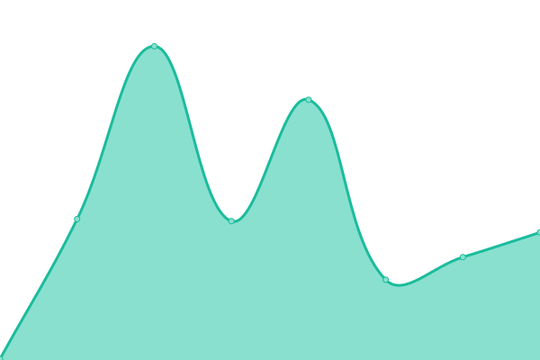

# [📈 Live Status](https://CyberLions-Italian-Community.github.io/status): <!--live status--> **Tutti i sistemi operativi**

This repository contains the open-source uptime monitor and status page for [CyberLions Italian Community](https://cyberlions-ita.eu/), powered by [Upptime](https://github.com/upptime/upptime).

With [Upptime](https://upptime.js.org), you can get your own unlimited and free uptime monitor and status page, powered entirely by a GitHub repository. We use [Issues](https://github.com/CyberLions-Italian-Community/status/issues) as incident reports, [Actions](https://github.com/CyberLions-Italian-Community/status/actions) as uptime monitors, and [Pages](https://CyberLions-Italian-Community.github.io/status) for the status page.

<!--start: status pages-->
<!-- This summary is generated by Upptime (https://github.com/upptime/upptime) -->
<!-- Do not edit this manually, your changes will be overwritten -->
<!-- prettier-ignore -->
| URL | Stato | Cronologia | Response Time | Uptime |
| --- | ------ | ------- | ------------- | ------ |
|  [Sito web](https://cyberlions-ita.eu) | Funzionante | [sito-web.yml](https://github.com/CyberLions-Italian-Community/status/commits/HEAD/history/sito-web.yml) | 

 130ms
     
 | 

<a href="https://status.cyberlions-ita.eu/history/sito-web">100.00%</a>
    

|  [Pagina social](https://social.cyberlions-ita.eu) | Funzionante | [pagina-social.yml](https://github.com/CyberLions-Italian-Community/status/commits/HEAD/history/pagina-social.yml) | 

 141ms
     
 | 

<a href="https://status.cyberlions-ita.eu/history/pagina-social">100.00%</a>
    

|  [Server TeamSpeak](164.132.251.188) | Funzionante | [server-team-speak.yml](https://github.com/CyberLions-Italian-Community/status/commits/HEAD/history/server-team-speak.yml) | 

 115ms
     
 | 

<a href="https://status.cyberlions-ita.eu/history/server-team-speak">100.00%</a>
    

|  [SinusBot](217.182.128.229) | Funzionante | [sinus-bot.yml](https://github.com/CyberLions-Italian-Community/status/commits/HEAD/history/sinus-bot.yml) | 

 115ms
     
 | 

<a href="https://status.cyberlions-ita.eu/history/sinus-bot">100.00%</a>
    

|  [Infrastruttura principale](217.182.128.229) | Funzionante | [infrastruttura-principale.yml](https://github.com/CyberLions-Italian-Community/status/commits/HEAD/history/infrastruttura-principale.yml) | 

 114ms
     
 | 

<a href="https://status.cyberlions-ita.eu/history/infrastruttura-principale">100.00%</a>
    

<!--end: status pages-->

[**Visit our status website →**](https://CyberLions-Italian-Community.github.io/status)

## 📄 License

- Powered by: [Upptime](https://github.com/upptime/upptime)
- Code: [MIT](./LICENSE) © [CyberLions Italian Community](https://cyberlions-ita.eu/)
- Data in the `./history` directory: [Open Database License](https://opendatacommons.org/licenses/odbl/1-0/)
